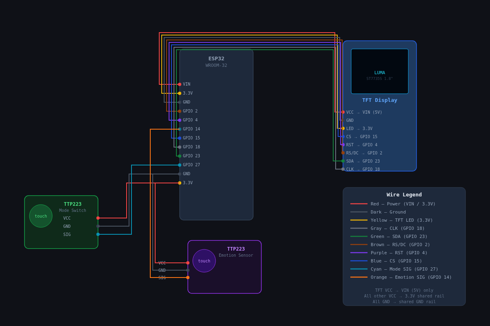

# Wiring

Pin numbers match the `#define`s at the top of [`LUMA_v3.ino`](../LUMA_v3.ino). The TFT runs
on the ESP32's default hardware SPI pins.

The tables below are the same thing in text. Same diagram is on [meetluma.live](https://www.meetluma.live/build).

## 1.8" ST7735S TFT → ESP32

| TFT | ESP32 |
|---|---|
| VCC | 3V3 |
| GND | GND |
| SCL / SCLK | GPIO 18 |
| SDA / MOSI | GPIO 23 |
| RES | GPIO 4 |
| DC | GPIO 2 |
| CS | GPIO 15 |
| BLK | 3V3 |

Run it off 3V3, not 5V.

## Touch sensor 1 (screen switch) → ESP32

Cycles through the face / clock / weather / calendar screens.

| TTP223 | ESP32 |
|---|---|
| VCC | 3V3 |
| GND | GND |
| I/O | GPIO 27 |

## Touch sensor 2 (emotions) → ESP32

Tap, spam-tap, and hold for the different reactions.

| TTP223 | ESP32 |
|---|---|
| VCC | 3V3 |
| GND | GND |
| I/O | GPIO 14 |

All three parts share the ESP32's 3V3 and GND. An ESP32 breakout board makes that a lot
less annoying. To move a pin, just change the `#define` in the sketch.
